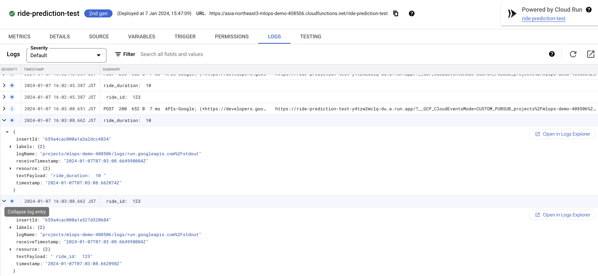
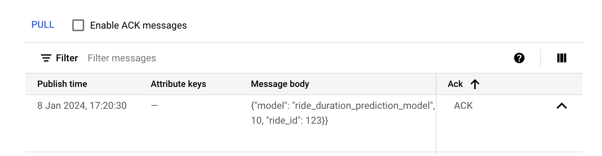

# Streaming Machine Learning Deployment
We will be working with `PubSub` and `Cloud Functions` on `GCP`. In case of `AWS`, we can use `AWS Lambda` and `AWS Kinesis`.

Workflow:
1. Send a trigger message to Stream/Topic A
2. Perform prediction with Cloud Function
3. Publish results to another output Stream B
4. Read and verify results from Stream B

Steps:
- Create a data `Stream A` with `Pub/Sub`
- Create a consumer cloud function and connect it to the stream
- Write consumer function definition that will consume from the stream
- Test and Deploy consumer function with `Cloud Functions`
- Trigger the function by publishing streaming data to `Pub/Sub` topic
- Create a `Stream B` for ingesting the output of the consumer function
- Verify the results from `Stream B`
- Add the actual `model` to our function
- Packaging

## Links
[Cloud Pub/Sub Tutorial](https://cloud.google.com/functions/docs/tutorials/pubsub)
[Cloud Pub/Sub Tutorial (2nd gen)](https://cloud.google.com/functions/docs/tutorials/pubsub#functions_helloworld_pubsub_tutorial-python)
[Overview of the Pub/Sub service](https://cloud.google.com/pubsub/docs/pubsub-basics)

# Before you begin
- Enable the Cloud Functions, Cloud Build, Artifact Registry, Eventarc, Cloud Logging API, Cloud Run Admin API, and Pub/Sub APIs in `APIs & Services`.

# Sample events
## JSON
```json
{
    "ride": {
        "PULocationID": 130,
        "DOLocationID": 205,
        "trip_distance": 3.66
    }, 
    "ride_id": 123
}
```

## Encoded (base64)
```
{
  "data": {
    "message": {
      "_comment": "data is base64 encoded string of 'Hello World'",
      "data": "ewogICAgInJpZGUiOiB7CiAgICAgICAgIlBVTG9jYXRpb25JRCI6IDEzMCwKICAgICAgICAiRE9Mb2NhdGlvbklEIjogMjA1LAogICAgICAgICJ0cmlwX2Rpc3RhbmNlIjogMy42NgogICAgfSwgCiAgICAicmlkZV9pZCI6IDEyMwp9"
    }
  },
  "type": "google.cloud.pubsub.topic.v1.messagePublished",
  "specversion": "1.0",
  "source": "//pubsub.googleapis.com/",
  "id": "1234567890"
}
```

# 01-Create Stream A:
Cerate a PubSub topic.
```
gcloud pubsub topics create YOUR_TOPIC_NAME
gcloud pubsub topics list
```

# 02-Consumer Function
Go to `Cloud Functions` and create a new function. Name it `ride-prediction-test` and select the `PubSub` trigger. Choose the topic that we created earlier. Since this is a stream, we also need to keep track of `Ride ID` to know which prediction belongs to which user.

Write the function code:
```python
import functions_framework
import base64
import json

def prepare_features(ride):
    features = {}
    features["PU_DO"] = "%s_%s" % (ride["PULocationID"], ride["DOLocationID"])
    features["trip_distance"] = ride["trip_distance"]
    return features

def predict(features):
    return 10.0

@functions_framework.http
def predict_duration(request):
    request_json = request.get_json(silent=True)
    ride = request_json["ride"]
    ride_id = request_json["ride_id"]
    features = prepare_features(ride)
    predicted_duration = round(predict(features))
    return {
      'ride_duration': predicted_duration, "ride_id": ride_id
      }
```

## Simple Test
For now we will use `https` request format to test our function. Click on `Test Function` and enter following input.
```json
{
    "ride": {
        "PULocationID": 130,
        "DOLocationID": 205,
        "trip_distance": 3.66
    }, 
    "ride_id": 123
}
```

Check the console output.
```
[3:12:08 PM] - Execution response: {"ride_duration":10,"ride_id":123}
```

*For now we are not using the actual `model` to get predictions.
*
## PubSub Test
Test with sample `PubSub` input. Use the above input dict and encode it to `base64` (PubSub works with encoded data). Paste the `encoded` input in `"data"` value.
```
{
  "data": {
    "message": {
      "_comment": "data is base64 encoded string of 'Hello World'",
      "data": "ewogICAgInJpZGUiOiB7CiAgICAgICAgIlBVTG9jYXRpb25JRCI6IDEzMCwKICAgICAgICAiRE9Mb2NhdGlvbklEIjogMjA1LAogICAgICAgICJ0cmlwX2Rpc3RhbmNlIjogMy42NgogICAgfSwgCiAgICAicmlkZV9pZCI6IDEyMwp9"
    }
  },
  "type": "google.cloud.pubsub.topic.v1.messagePublished",
  "specversion": "1.0",
  "source": "//pubsub.googleapis.com/",
  "id": "1234567890"
}
```

Update the testing code.
```python
import base64
import json
import functions_framework

def prepare_features(ride):
    features = {}
    features["PU_DO"] = "%s_%s" % (ride["PULocationID"], ride["DOLocationID"])
    features["trip_distance"] = ride["trip_distance"]
    return features

def predict(features):
    return 10.0

@functions_framework.cloud_event
def predict_duration(cloud_event):
    decoded = base64.b64decode(cloud_event.data["message"]["data"])
    data = json.loads(decoded)
    ride = data["ride"]
    ride_id = data["ride_id"]
    features = prepare_features(ride)
    predicted_duration = round(predict(features))
    print('ride_duration: ', predicted_duration, "\n", "ride_id: ", ride_id)

```

Test the function.
```
[3:40:15 PM] - Execution response: OK
[3:40:16 PM] - ride_duration:  10 
 ride_id:  123
```

Deploy the function. It will take some time.

# 03-Trigger the function with PubSub
Now we will trigger our consumer function by sending a message to `PubSub topic`.

## Publish a message to the topic
```
gcloud pubsub topics publish taxi-ride-streaming --message '{
    "ride": {
        "PULocationID": 130,
        "DOLocationID": 205,
        "trip_distance": 3.66
    },
    "ride_id": 123
}'
```

We can also do this by `Pub/Sub > Topics > MY-TOPIC > MESSAGES > PUBLISH MESSAGE`. Copy and paste the above message. Click on `Publish`. this will trigger our function.

## Read the function logs to see the result:
```
gcloud functions logs read \
  --gen2 \
  --region=asia-northeast3 \
  --limit=5 \
  ride-prediction-test
```
```
LEVEL  NAME                  TIME_UTC                 LOG
       ride-prediction-test  2024-01-07 07:03:08.662   ride_id:  123
       ride-prediction-test  2024-01-07 07:03:08.662  ride_duration:  10

```

We can also check the response in UI inside `LOGS`.


Update the function slightly.
```python
@functions_framework.cloud_event
def predict_duration(cloud_event):
    decoded = base64.b64decode(cloud_event.data["message"]["data"])
    data = json.loads(decoded)
    ride = data["ride"]
    ride_id = data["ride_id"]
    features = prepare_features(ride)
    predicted_duration = round(predict(features))
    prediction = {
      'ride_duration': predicted_duration, "ride_id": ride_id
      }
    print(prediction)
    return {
        "prediction": prediction
    }
```

Publish a message and check logs again.
```
LEVEL  NAME                  TIME_UTC                 LOG
       ride-prediction-test  2024-01-07 07:30:55.244  {'ride_duration': 10, 'ride_id': 123}
```

# 04-Create a new Stream B
First, we need to create a new stream. Head over to `PubSub Topics` and create a new topic. I named mine `ride-predictions`.

# 05-Publish the results to Stream B
Since this is not `client-server` model, we need to put our results to another stream. Here we can use `PublisherClient` provided by `GCP`. For `AWS` we can use `boto3`.

## Modify the cloud function.
```python
import os
import base64
import json
import functions_framework
from google.cloud import pubsub_v1

publisher = pubsub_v1.PublisherClient()
PROJECT_ID = os.getenv("PROJECT_ID", "mlops-demo-408506")
TOPIC_NAME = os.getenv("PUBLISH_STREAM", "ride-predictions")
topic_path = publisher.topic_path(PROJECT_ID, TOPIC_NAME)


def prepare_features(ride):
    features = {}
    features["PU_DO"] = "%s_%s" % (ride["PULocationID"], ride["DOLocationID"])
    features["trip_distance"] = ride["trip_distance"]
    return features

def predict(features):
    return 10.0

def publish_to_topic(project_id, topic_name, message_json):
    # Encode the message json
    message_encoded = json.dumps(message_json).encode("utf-8")
    # Publish the message to the topic
    future = publisher.publish(topic_path, data=message_encoded)
    # Verify that the message has arrived
    print(future.result())

@functions_framework.cloud_event
def predict_duration(cloud_event):
    decoded = base64.b64decode(cloud_event.data["message"]["data"])
    data = json.loads(decoded)
    ride = data["ride"]
    ride_id = data["ride_id"]
    features = prepare_features(ride)
    predicted_duration = round(predict(features))
    prediction = {
        'model': "ride_duration_prediction_model",
        'version': 123,
        'prediction': {
            'ride_duration': predicted_duration, 
            "ride_id": ride_id
        }
      }

    # Publish the result to another Pub/Sub topic
    publish_to_topic(PROJECT_ID, TOPIC_NAME, prediction)

    return prediction
```

*Make sure to add `google-cloud-pubsub` in `requirements.txt` of your cloud function. Otherwise, you will face deployment error.*

## Test the function:
1. Publish message to the first stream
2. Cloud function will get triggered
3. Check the log of the consumer function

```
gcloud functions logs read   --gen2   --region=asia-northeast3   --limit=1   ride-prediction-test
```

```
LEVEL  NAME                  TIME_UTC                 LOG
       ride-prediction-test  2024-01-07 15:48:15.407  9155007615350620
```


# 06-Verify the published results
We are now able to write to another stream. Now we need to read from this stream and verify that our function actually works.

Publish a message to stream A.
```
gcloud pubsub topics publish taxi-ride-streaming --message '{
    "ride": {
        "PULocationID": 130,
        "DOLocationID": 205,
        "trip_distance": 3.66
    },
    "ride_id": 123
}'
messageIds:
- '10133540205021770'
```

Check cloud function logs.
```
LEVEL  NAME                  TIME_UTC                 LOG
       ride-prediction-test  2024-01-08 08:22:49.792  9157121336959326
```

### Using Console
The easy way is to go to out stream B i.e. `ride-predictions > ride-predictions-sub > MESSAGES` and then click on `PULL`.


### Using CLI
```
gcloud pubsub subscriptions pull ride-predictions-sub                          ─╯
┌──────────────────────────────────────────────────────────────────────────────────────────────────────────────────┬──────────────────┬──────────────┬────────────┬──────────────────┬────────────────────────────────────────────────────────────────────────────────────────────────────────────────────────────────────────────────────────────────────────────────────────────────┐
│                                                       DATA                                                       │    MESSAGE_ID    │ ORDERING_KEY │ ATTRIBUTES │ DELIVERY_ATTEMPT │                                                                                             ACK_ID                                                                                             │
├──────────────────────────────────────────────────────────────────────────────────────────────────────────────────┼──────────────────┼──────────────┼────────────┼──────────────────┼────────────────────────────────────────────────────────────────────────────────────────────────────────────────────────────────────────────────────────────────────────────────────────────────┤
│ {"model": "ride_duration_prediction_model", "version": 123, "prediction": {"ride_duration": 10, "ride_id": 123}} │ 9157203630716966 │              │            │                  │ PkVTRFAGFixdRkhRNxkIaFEOT14jPzUgKEUXC1MTUVx1HF4QaV4zdQdRDRlzdTIgYlgbUwNDVHRdURsfWVxE4dSPkS9QXWh0b10RAQFDUH5YWh0Eblp0yKnIr7j-sEBvUWKH0tzZZV7cu-ZEZiE9XBJLLD5-IzxFQV5AEkwoCURJUytDCypYEU4EISE-MA │
└──────────────────────────────────────────────────────────────────────────────────────────────────────────────────┴──────────────────┴──────────────┴────────────┴──────────────────┴────────────────────────────────────────────────────────────────────────────────────────────────────────────────────────────────────────────────────────────────────────────────────────────────┘

```

We can format it to `json`. I will be using `jq` for nice formatting and colors.
```
gcloud pubsub subscriptions pull ride-predictions-sub --format=json | jq 
```

```json      ─╯
[
  {
    "ackId": "RVNEUAYWLF1GSFE3GQhoUQ5PXiM_NSAoRRcLUxNRXHUcXhBpXjN1B1ENGXN1MiBiWBtTA0NUdF1RGx9ZXES81I-RL1BdaHRvXREBAUNQflhaHQRuWnTIqcivuP6wQG9WYtrS3NllXtXm_dFZZiE9XBJLLD5-IzxFQV5AEkwoCURJUytDCypYEU4EISE-MD4",
    "message": {
      "data": "eyJtb2RlbCI6ICJyaWRlX2R1cmF0aW9uX3ByZWRpY3Rpb25fbW9kZWwiLCAidmVyc2lvbiI6IDEyMywgInByZWRpY3Rpb24iOiB7InJpZGVfZHVyYXRpb24iOiAxMCwgInJpZGVfaWQiOiAxMjN9fQ==",
      "messageId": "9157203630716966",
      "publishTime": "2024-01-08T08:25:04.109Z"
    }
  }
]

```

Now we also need to decode the `data` field.
```
gcloud pubsub subscriptions pull ride-predictions-sub --format=json | jq -r '.[].message.data' | base64 --decode | jq
```
```json
{
  "model": "ride_duration_prediction_model",
  "version": 123,
  "prediction": {
    "ride_duration": 10,
    "ride_id": 123
  }
}
```

# 07-Adding model to the function

## Changes
Create a `cloud_function.py` and paste the function code. Then add the model loading part.
```python
# Load model
EXPERIMENT_ID = 1
RUN_ID = "553def03f5224f649fe56bc1567daccc"
logged_model = f"gs://pytholic-mlops-zoomcamp-artifacts/{EXPERIMENT_ID}/{RUN_ID}/artifacts/model"
model = mlflow.pyfunc.load_model(logged_model)
```

Modify the `predict` function.
```python
def predict(features):
    pred = model.predict(features)
    return pred[0]
```

Due to a `dict` error, I also had to modify the following:
```
decoded = base64.b64decode(cloud_event.data["message"]["data"]) # before
decoded = base64.b64decode(cloud_event["data"]["message"]["data"]) # after
```

Also add the `key` file to grant access.
```python
KEY_PATH = "/home/pytholic/service_account_key.json"
os.environ["GOOGLE_APPLICATION_CREDENTIALS"] = "/home/pytholic/service_account_key.json"
```

## Test
Write a `test.py`.
```python
import cloud_function

event = {
  "data": {
    "message": {
      "_comment": "data is base64 encoded string of 'Hello World'",
      "data": "ewogICAgInJpZGUiOiB7CiAgICAgICAgIlBVTG9jYXRpb25JRCI6IDEzMCwKICAgICAgICAiRE9Mb2NhdGlvbklEIjogMjA1LAogICAgICAgICJ0cmlwX2Rpc3RhbmNlIjogMy42NgogICAgfSwgCiAgICAicmlkZV9pZCI6IDEyMwp9"
    }
  },
  "type": "google.cloud.pubsub.topic.v1.messagePublished",
  "specversion": "1.0",
  "source": "//pubsub.googleapis.com/",
  "id": "1234567890"
}

res = cloud_function.predict_duration(event)
print(res)
```

Run.
```
python test.py

{'model': 'ride_duration_prediction_model', 'version': 123, 'prediction': {'ride_duration': 18, 'ride_id': 123}}
```

You can also check Stream B messages.
```
gcloud pubsub subscriptions pull ride-predictions-sub --limit=1 --format=json | jq -r '.[].message.data' | base64 --decode | jq
```
```json
{
  "model": "ride_duration_prediction_model",
  "version": 123,
  "prediction": {
    "ride_duration": 18,
    "ride_id": 123
  }
}
```

# 08-Packaging