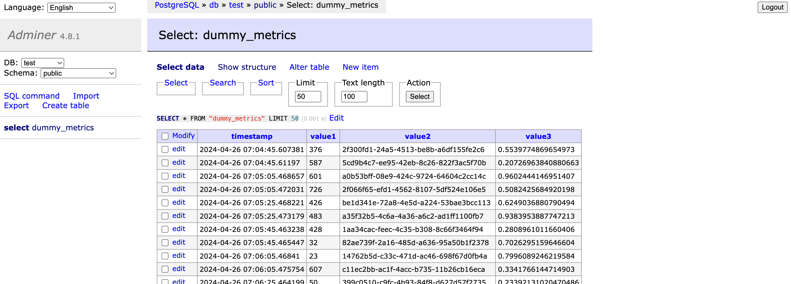
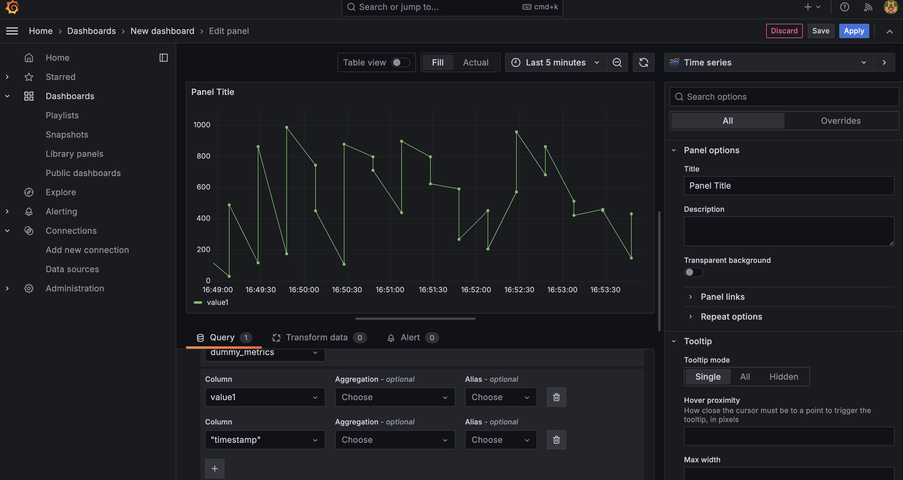
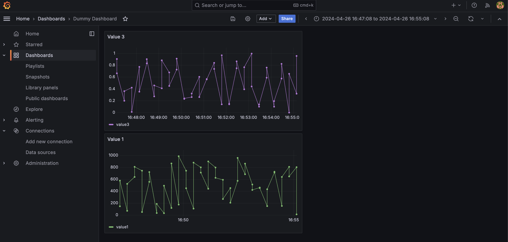
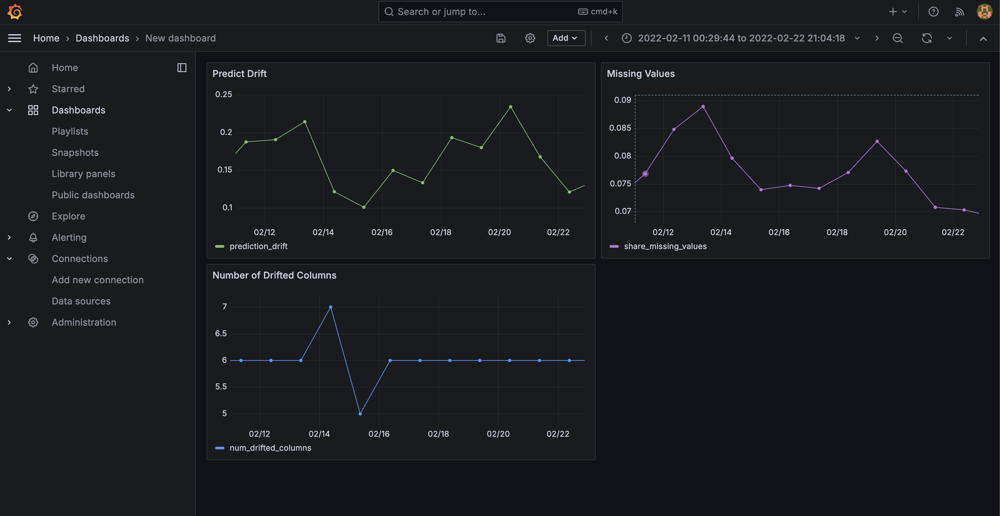

# Model Monitoring

Very often we see that ML models start to degrade in production. Therefore, we should always monitor our models in production. Some things to monitor are:

- Service health
  - Uptime
  - Memory
  - Latency
- Model performance
  - Accuracy, precision, recall, etc.
- Data quality and integrity
- Data and concept drift
- Performance by segment
- Model bias and fairness
- Outliers
- Explainability

# How to monitor?

## Batch vs Online Serving Models

The way how we deploy a model might influence the way we implement monitoring. In **batch models**, it is easy to compare current distribution(batch data) with a reference distribution (data).
However, when it comes to **non-batch models**, it becomes bit more complicated. Some metrics like missing-values can be computed in real-time. But when it comes to metrics like data drift or model performance, it is much better to generate a batch of data and the calculate these metrics. In such cases, we can use window functions with some window and step size.

## Monitoring Scheme

Our monitoring scheme will be as follows:

- Duration prediction service that will generate predictions
- Prediction logs generated by the service
- Prefect to implement monitoring jobs
- Evidently library as the evaluation layer to calculate some metrics and store in PostgreSQL
- A metrics dashboard with Grafana based on SQL data

# Set up the environment and creating services

Install the following requirements:

```
pip install evidently psycopg psycopg_binary
```

Next, we will use `docker-compose.yml` to create the required services:

- PostgreSQL
- Adminer (web-based database management tool)
- Grafana

Build the services:

```
docker compose up --build
```

Test if services are up and running. Head over to `localhost:8080` to check Grafana and `localhost:3000` to check Aminer.

# Create model and reference data

We will use `baseline_model_nyc_taxi_data.ipynb` to create our model and reference data. We will use this reference data to calculate feature like data drift, missing values, prediction or target drift. This will act as a reference distribution which we are happy with. In our case, this will be our validation data set.

# Dummy monitoring

Next we will use same notebook to perform some dummy monitoring using **Evidently** package. Reference code can be found at `05-Monitoring/baseline_model_nyc_taxi_data.ipynb`. Here we use training data as our reference data and validation data as current data.

We use the `html` format for quick analysis, but for the automation purpose (pipelines) it is better to work with a different format. In our case, we will use python object (dictionary) format. This way we can easily derive values from the dictionary and use them for subsequent tasks.

# Data quality monitoring

First we will try whether we can create some dummy metrics, load it into our database, and then access it through Grafana. We will also add some sleep time in order to simulate real usage where values are written and visualized after some delay. Code for this part is inside `05-Monitoring/dummy_metrics_calculation.py`.

Open terminal and run services:

```
docker compose up
```

Open another window and run the script.

```
dummy_metrics_calculation.py

2024-04-26 16:06:05,467 [INFO]: data sent
2024-04-26 16:06:05,475 [INFO]: data sent
2024-04-26 16:06:25,463 [INFO]: data sent
```

Head over to the browser and open `localhost:8080` where our adminer service is running. Enter username and password. In my case it is username is "postgres" and password is "example". We can see data being written into our table.



Now open Grafana by going to `localhost:3000`. Enter username "admin" and password "admin". Go to `Dashboards -> New Dashboard -> Add Visualization`. Select correct data source.

> \[!NOTE\]
> If you cannot see data source, select `Open a new tab and configure a data source`. Fill in url, username, password, and disable TTL. Make sure the values match to those define inside `config/grafana_datasources.yaml`. In my case url `localhost:5432` failed and `db.:5432` worked.

After that build query, select a value. Add another value for `timestamp` or else it will say time not found. then your dashboard should look like:



Click `Apply` and save the dashboard. We can visualize more values by adding additional visualization in our dashboard.



# Working with actual values

Now we will alter our script `05-Monitoring/evidently_metrics_calculation.py`. We will modify the way we calculate metrics.

In order to simulate production usage, we will read our data day by day. We will then calculate metrics and generate report for each day. Now we will use february data for our predictions (current data) instead of validation data. We can follow then steps above and check our table via Adminer.

We can also convert our script into a Prefect pipeline. After that head over to Grafana and create dashboard same as before.



# Save Grafana Dashboard

We want to persist our Grafana dashboards.

Create a file `05-Monitoring/config/grafana_dasboards.yaml`. In this config file file we need to specify path for our dashboards. Create a new directory `05-Monitoring/dashboards`, and inside this directory create a file names `data_drift.json`. Note that Grafana uses json format. Also make sure to update Grafana volumes in `docker-compose.yml`.

Now we need to write data to our `data_drift.json`. Go to Grafana dashboard, settings, JSON model and copy it. Paste it inside `data_drift.json`.

Now if we stop and run our containers again, we should see same dashboard. Note that it only persists the panels/layout and not the actual data values. Run the script again to send some values to the dashboard.
