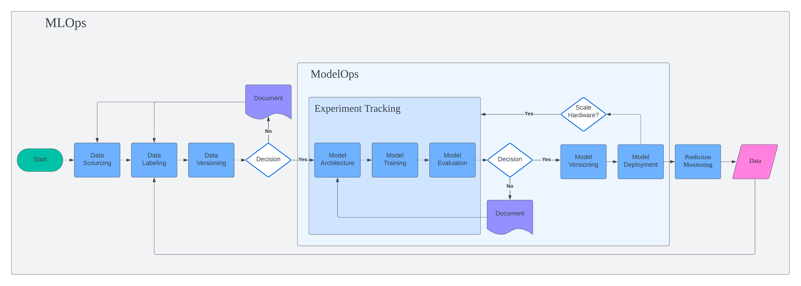
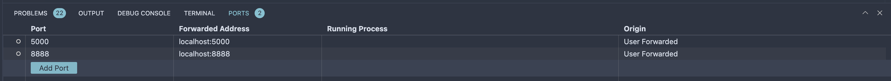

# MLOps Pipeline


We will be training simple regression models on NYC taxi ride dataset and build MLOps pipeline including model training, hyperparameter optimization, experiment tracking, orchestrating, deployment, monitoring, etc. This repository is based on the MLOps course by DataTalks.Club.

# Notes
[Setting up a VM on GCP](notes/gcp_setup.md)<br>
[Dataset](notes/dataset.md)<br>
[MLFlow Experiment Tracking](notes/mlflow.md)<br>
[MLFlow Experiment Tracking on GCP](notes/mlflow_gcp.md)
[Workflow Orchestration with Prefect](notes/orchestration.md)

# Setup

## Install requirements

Create environment

```
conda create -n exp-tracking python=3.9
```

Create `requirements.txt`

```
mlflow
jupyter
scikit-learn
pandas
seaborn
hyperopt
xgboost
prefect
prefect-gcp
```

Install requirements
```
pip install -r requirements.txt
```

**Sklearn** - For machine learning
**MLFlow** - For experiment tracking
**Prefect** - For workflow orchestration

## For remote VM
Forward MLflow port which is `0.0.0.0:5000`.


Forward the port for `jupyter` if you are using it (`127.0.0.1:8888`).


Forward port for Prefect server (`127.0.0.1:4200`).

You can also do it in `~/.ssh/config`.
```
Host gcp-mlflow-tracking-server
    HostName xx.xx.xx.xxx # VM Public IP
    User pytholic # VM user
    IdentityFile ~/.ssh/mlops-zoomcamp # Private SSH key file
    StrictHostKeyChecking no
    LocalForward 5001 0.0.0.0:5000
```