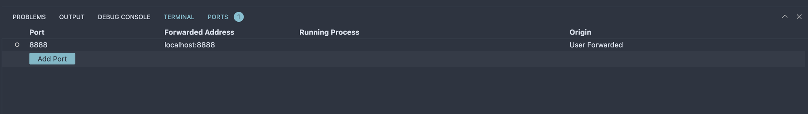

# MLOps Pipeline

This repository is my official beginning of MLOps journey. Instead of focusing on piece of production-grade machine learning, we will be building full end-to-end pipeline.

We will be training simple regression models on NYC taxi ride dataset and build MLOps pipeline including model training, hyperparameter optimization, experiment tracking, orchestrating, deployment, monitoring, etc. This repository is inspired by the `mlops-zoomcamp` course by DataTalks.Club.

*Since the MLOps tool landscape is very wide, There will be more follow up work on this with various tech stacks.*

# Tech Stack

# Notes
[Setting up a VM on GCP](notes/gcp_setup.md)<br>
[Dataset](notes/dataset.md)<br>
[MLFlow Experiment Tracking](notes/mlflow.md)<br>
[MLFlow Experiment Tracking on GCP](notes/mlflow_gcp.md)<br>
[Workflow Orchestration with Prefect](notes/orchestration.md)<br>
[Model Deployment as a web-service with Docker, Kubernetes, and GKS.](notes/web_service_deployment.md)<br>
[Model Deployment with model from model registry](04-deployment/web-service-mlflow/README.md)<br>
[Streaming Model Deployment (Online)](04-deployment/streaming/README.md)
[Batch Model Deployment (Offline)](04-deployment/batch/README.md)
[Scheduling batch scoring jobs with Prefect](04-deployment/batch/README.md#scheduling-batch-scoring-jobs-with-prefect)

# Setup

## Install requirements

Create environment

```
conda create -n exp-tracking python=3.9
```

Create `requirements.txt`

```
mlflow
jupyter
scikit-learn
pandas
seaborn
hyperopt
xgboost
prefect
prefect-gcp
flask
requests
gunicorn
pip-tools
```

Install requirements
```
pip install -r requirements.txt
```

## For remote VM
Forward MLflow port which is `0.0.0.0:5000`.


Forward the port for `jupyter` if you are using it (`127.0.0.1:8888`).


Forward port for Prefect server (`127.0.0.1:4200`).

You can also do it in `~/.ssh/config`.
```
Host gcp-mlflow-tracking-server
    HostName xx.xx.xx.xxx # VM Public IP
    User pytholic # VM user
    IdentityFile ~/.ssh/mlops-zoomcamp # Private SSH key file
    StrictHostKeyChecking no
    LocalForward 5001 0.0.0.0:5000
    LocalForward 4200 127.0.0.1:4200
```