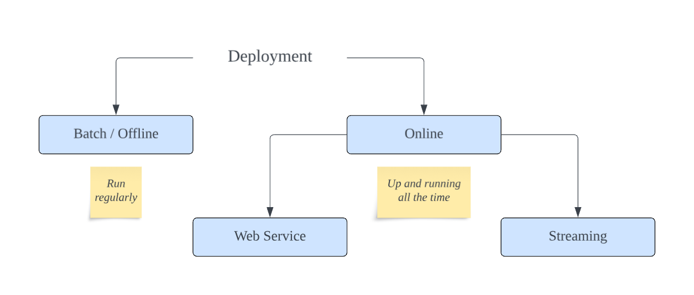
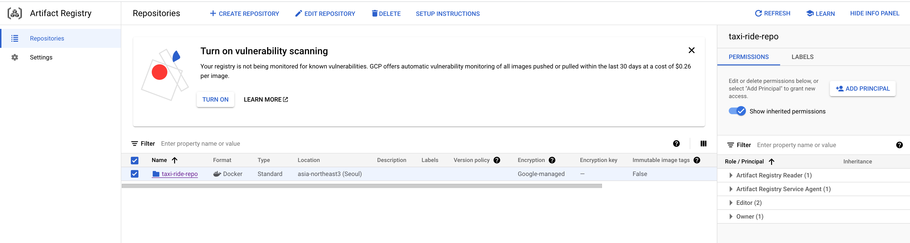

# Deployment
After designing and orchestrating our pipeline, we can deploy our model. When it comes to model deployment, there are multiple options depending on how often we require predictions.

`Batch/Offline Deployment` - In batch deployment, the model is up and running all the time. We just apply our model to new data regularly.<br>
`Online Deployment` - When we need model up and running all the time i.e. we need predictions as soon as possible.



## Batch Deployment
When we need to apply model regularly e.g. every 10 minutes, every hours, every day, etc. It involves following components:
- Input database
- Scoring job
- Predictions database
- Report

Working with patient *medical records* is a good example of an offline deployment task. Another example can be *marketing*.

## Online Deployment
It has multiple variants.

`Web Service` -  We can send `HTTP` request and get back the predictions.<br>
`Streaming` - Model service is listening for *events* on the stream and react to this.

### Web Service
Pretty common way of deploying machine learning models. Our example of *taxi ride duration* is a good example. The user immediately wants to know how long the ride will take along with the cost.<br>
It is a `one-to-one` relationship between the client and the server.

### Streaming
We have producers and consumers. `Producer` pushes an `event` to event stream, and `consumers` will read from this stream and react. It is `one-to-many` or `many-to-many` relationship. *There is no explicit connect between the producers and the consumers. A good example is *content moderation* or a *recommendation system*.

# Taxi Ride Duration Deployment
We will deploy our model as a **Web Service**. We can take our `pickle` model and deploy it.

## What we will cover
- Creating a virtual environment
- Creating a prediction script
- Converting script into a `Flask` app
- Packaging the app with `Docker`
- Deployment with `Kubernetes`
- Deployment on `Google Kubernetes Engine`

## Docker Deployment
### Install packages
First of all we need to check the `scikit-learn` version used to create the model. We need ot match this version, otherwise we might face some issues.
```
 pip freeze | grep scikit-learn
```

Create a new virtual environment and install dependencies.
```
conda create -n deployment python=3.9.18
pip install scikit-learn==1.3.2 flask requests
```
We only need `requests` in dev environment.

### Create and test app
Create the prediction script and app as in `04-deployment/web-service/predict`. 

Test the `app`.
```python
import requests

ride = {
    "PULocationID": 10,
    "DOLocationID": 50,
    "trip_distance": 40
}

url = "http://127.0.0.1:9696/predict"
response = requests.post(url, json=ride)
print(response.json())
```
```
python test.py

{'duration': 25.82088226584449}
```

### Using Gunicorn
Flask web service is only used for development purposes. In production, we use `gunicorn`.
```
pip install gunicorn
```

Run and test the app.
```
gunicorn --bind=0.0.0.0:9696 predict:app
python test.py
```

### Containerize the app

#### Get correct versions
We will be using `pip-tools`.
```
pip install pip-tools
```

Create `requirements.in`.
```
scikit-learn
flask
requests
gunicorn
pip-tools
```

Generate `requirements.txt`.
```
pip-compile
```

#### Create Dockerfile
```Dockerfile
FROM python:3.9.18-slim

RUN pip install -U pip

WORKDIR /app

COPY requirements.txt ./

RUN pip install -r requirements.txt

COPY [ "predict.py", "lin_reg.bin", "./" ]

EXPOSE 9696

ENTRYPOINT [ "gunicorn", "--bind=0.0.0.0:9696", "predict:app" ]
```

#### Build and run the app
Build
```
docker build -t ride-duration-prediction-service:v1 .
```

Run
```
docker run -it --rm -p 9696:9696 ride-duration-prediction-service:v1
```

In another terminal, run:
```
python test.py

{'duration': 25.82088226584449}
```

## Kubernetes deployment
Kubernetes gives us a way to deploy local docker images to the cloud. There are several benefits of using kubernetes over simple docker deployments including:
- Automatic Scaling
- Local Balancing
- Rolling updates nad Rollbacks

We will:
- Set up a local kubernetes cluster
- Create a deployment
- Deploy app
- Test the app
- Create a service

### Kubernetes setup

#### Install kubectl
Follow [instructions](https://cloud.google.com/kubernetes-engine/docs/how-to/cluster-access-for-kubectl#apt).

#### Install kind
Kind uses docker to create a kubernetes cluster on our local machine.

Follow [instructions](https://kind.sigs.k8s.io/docs/user/quick-start/).
```
kind --version
``` 

Create cluster. It will take some time for the first time.
```
kind create cluster
```

Set `kubectl` context to `kind-kind`.
```
kubectl cluster-info --context kind-kind
```

Verify.
```
kubectl get service
docker ps
```

### Create a deployment
`app.yaml`
```
apiVersion: apps/v1
kind: Deployment
metadata:
  name: flask-app
  labels:
    app: app-deployment
spec:
  replicas: 1
  selector:
    matchLabels:
      app: app
  template:
    metadata:
      labels:
        app: app
    spec:
      containers:
        - name: app-pod
          image: ride-duration-prediction-service:v1
          resources:
            limits:
              memory: "512Mi"
              cpu: "1"
          ports:
            - containerPort: 9696
          imagePullPolicy: IfNotPresent
```

### Load image into the cluster
Load image into `kind` registry.
```
kind load docker-image ride-duration-prediction-service:v1 
```

Verify.
```
docker exec -it kind-control-plane crictl images
```

### Deploy app to kubernetes
Apply the deployment.
```
kubectl apply -f app.yaml
```

Verify.
```
kubectl get deployment
kubectl get pod
```

### Test the deployed app
Before we create a service, we can test the deployment using **port forwarding**.

Get the name of the `pod`.
```
kubectl get pod
```

Forward the port.
```
kubectl port-forward flask-app-597745dfcf-27xcc 9696:9696
```

Open another terminal on local machine and run:
```
python test.py

{'duration': 25.82088226584449}
```

You will also see a response in port forward terminal:
```
Forwarding from 127.0.0.1:9696 -> 9696
Forwarding from [::1]:9696 -> 9696
Handling connection for 9696
Handling connection for 9696
```

### Create a service
In a Kubernetes cluster, each Pod has an internal IP address. But the Pods in a Deployment come and go, and their IP addresses change. So it doesn’t make sense to use Pod IP addresses directly. With a Service, we get a stable IP address that lasts for the life of the Service, even as the IP addresses of the member Pods change.

Add to `app.yaml`.

```
---
apiVersion: v1
kind: Service
metadata:
  name: flask-app-service
spec:
  type: NodePort
  selector:
    app: app
  ports:
    - protocol: TCP
      port: 80
      targetPort: 9696
      nodePort: 30001
```

Here `targetPort` is the port from our pod, `port` is the access port within the cluster, and `nodePort` is for external access (outside the cluster). 

Now we need `INTERNAL_IP` and we will combine it with `nodePort` to access our application.

```
# Get internal ip
kubectl get node -o wide

# Get port
kubectl get svc
```

Now we can access our app at `INTERNAL_IP:nodePort` e.g. `172.18.0.2:30001`. Modify the `URL` in `test.py`.
```
import os
import requests

ride = {
    "PULocationID": 10,
    "DOLocationID": 50,
    "trip_distance": 40
}

url = "http://172.18.0.2:30001/predict"
response = requests.post(url, json=ride)
print(response.json())
```

Run the script.
```
python test.py

{'duration': 25.82088226584449}
```

Instead of using direct port forwarding, we are now using kubernetes service

In my case, I am using VM on google cloud. So I need to forward the port in `~/.ssh/config`.
```
Host gcp-mlops-zoomcamp
    HostName xx.xx.xxx.xxx # VM Public IP
    User pytholic # VM user
    IdentityFile ~/.ssh/mlops-zoomcamp # Private SSH key file
    StrictHostKeyChecking no
    LocalForward 5000 0.0.0.0:5000
    LocalForward 9696 0.0.0.0:9696
    LocalForward 30001 172.18.0.2:30001
    LocalForward 4200 127.0.0.1:4200
```

## Deployment on GKE
We will be following [this](https://cloud.google.com/kubernetes-engine/docs/tutorials/hello-app) example.

### Enable API
Enable `Kubernetes Engine API` in the GCP Dashboard.

### Push image to GCR (deprecated)

Normally we can get project ID, create docker image, tag it and push to GCR (Google Container Registry).
```
# Authenticate with GCR
gcloud auth configure-docker

# Get project ID
gcloud projects list.

# Tag image
docker tag ride-duration-prediction-service:v1 gcr.io/your-project-id/ride-duration-prediction-service:v1

# Push to GCR
docker push gcr.io/your-project-id/ride-duration-prediction-service:v1
```

However, Container Registry is deprecated. Now we are advised to use Artifact Registry.

### Push image to Artifact Registry
You must upload the container image to a registry so that your GKE cluster can download and run the container image.

#### 01-Tag the image
First of all, tag the image:
```
docker tag ride-duration-prediction-service:v1  asia-northeast3-docker.pkg.dev/mlops-demo-408506/taxi-ride-repo/ride-duration-prediction-service:v1
```

#### 02-Create an artifact repository
Next, we need to create an `artifact repository` on GCP. We can use Dashboard for it or the CLI. Make sure you have the correct permissions.
```
# CLI
gcloud artifacts repositories create taxi-ride-repo \
    --repository-format=docker \
    --location=asia-northeast3

# Dashboard
Artifact Registry > CREATE REPOSITORY
```

#### 03-Set registry permissions
The add correct permissions to your service account. I am using `owner` account on local machine to give correct permission to the service account. Then I will this service account in my remote VM to push the docker image.

```
gcloud artifacts repositories add-iam-policy-binding taxi-ride-repo \
    --location=asia-northeast3 \
    --member=serviceAccount:<SERVICE ACCOUNT ID>-compute@developer.gserviceaccount.com \
    --role="roles/artifactregistry.reader"
```

Verify the repository and permissions.
```
gcloud artifacts repositories list --location=asia-northeast3
```


#### 04-Set authentication 
```
gcloud auth activate-service-account <SERVICE ACCOUNT ID>-compute@developer.gserviceaccount.com --key-file=service_account_key.json
```
[Refrence](https://cloud.google.com/artifact-registry/docs/docker/authentication)

#### 05-Push image to the registry
```
docker push asia-northeast3-docker.pkg.dev/mlops-demo-408506/taxi-ride-repo/ride-duration-prediction-service:v1
```

### Create a GKE cluster
Create a GKE cluster. It will take some time.
```
gcloud container clusters create taxi-ride-cluster 
gcloud container clusters list
```

If you see `gke-gcloud-auth-plugin` related issue, install it:
```
gcloud components install gke-gcloud-auth-plugin
or
sudo apt-get install google-cloud-sdk-gke-gcloud-auth-plugin
```

### Deploying the app to GKE
We are now ready to deploy our Docker image to your GKE cluster.

Ensure that you are connected to your GKE cluster.
```
gcloud container clusters get-credentials taxi-ride-cluster --region asia-northeast3-a
```

Create a Kubernetes Deployment for the `taxi-ride` app Docker image.
```
kubectl create deployment taxi-ride-app --image=asia-northeast3-docker.pkg.dev/<PROJECT ID>/taxi-ride-repo/ride-duration-prediction-service:v1

kubectl get deployment
```

Expose app to the internet. The default Service type in GKE is called `ClusterIP`, where the Service gets an IP address reachable only from inside the cluster. To expose a Kubernetes Service outside the cluster, create a Service of type `LoadBalancer`.
```
kubectl expose deployment taxi-ride-app --name=taxi-ride-app-service --type=LoadBalancer --port 80 --target-port 9696

service/taxi-ride-app-service exposed
```

Run the following command to get the Service details for `taxi-ride-app-service` and note the `EXTERNAL IP`.
```
kubectl get service
```
*Note: It might take a few minutes for the Load Balancer to be provisioned. Until the Load Balancer is provisioned, you might see a `<pending>` IP address.*

In the test script `test.py` modify the url to the new address and test the deployment.
```python
import os
import requests

ride = {
    "PULocationID": 10,
    "DOLocationID": 50,
    "trip_distance": 40
}

url = "http://<EXTERNAL IP>/predict" # GKE
response = requests.post(url, json=ride)
print(response.json())
```

### Clean up
Delete the service.
```
kubectl delete service taxi-ride-app-service
```

Delete the cluster.
```
gcloud container clusters delete taxi-ride-cluster --region asia-northeast3-a
```

Delete the container images.
```
gcloud artifacts docker images delete \
    asia-northeast3-docker.<PROJECT ID>/taxi-ride-repo/ride-duration-prediction-service:v1 \
    --delete-tags --quiet
```

# Getting the model from model registry
## Setup
- Run an experiment with `RandomForestRegressor`
- Save `tracking data` in local storage
- Save `artifacts` in GCP Bucket
- Load the model from `model registry`
- Deploy the model as `web service`

## Create a GCP Bucket
Create a new Google Cloud Storage Bucket.
```
gcloud storage buckets create gs://BUCKET_NAME --project=PROJECT_ID --default-storage-class=STANDARD --location=BUCKET_LOCATION --uniform-bucket-level-access
```

```
gcloud storage buckets create gs://mlops-zoomcamp-artifacts --project=mlops-demo-408506 --default-storage-class=STANDARD --location=asia-northeast3 --uniform-bucket-level-access
```

## Start MLFlow server
```
mlflow server --host=0.0.0.0 \
--backend-store-uri=sqlite:///mfllow.db \
--default-artifact-root=gs://pytholic-mlops-zoomcamp-artifacts/
```

## Train the model and save in registry
Follow `04-deployment/web-service-model-registry/random-forest.ipynb`. We will make use of `sklearn pipeline`. Save the model and `dict_vectorizer.bin` in the registry bucket.

## Run Prediction
Make changes as shown in `04-deployment/web-service-mlflow/predict.py` to load model and dict vectorizer from mlflow server.

We also need to install `mlflow` and `boto3` in our `deployment` environment.
```
pip install mlflow boto3 google-cloud-storage
```

Test.
```
python test.py


{'duration': 45.50965007660853, 'model_version': '553def03f5224f649fe56bc1567daccc'}
```