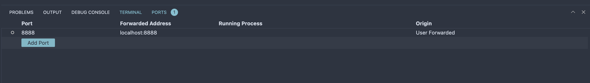

# Setting up a VM on GCP

## **Step 1: Login to GCP console and create project**

Name: `mlops-demo`

## **Step 2:** **Create an instance using Compute Engine**

```
Configuration:

Name: mlops-zoomcamp
Region: asia-northeast3 (Seoul)
Zone: asia-northeast3-a
Series: N2
Machine Type: n2-standard-4
Boot disk:
Image: Ubuntu 22.04 LTS (30 GB)
Firewall: Check both
Allow HTTP traffic
Allow HTTPS traffic
```

## **Step 3:** **Assign static IP**

*View Network details > IP addresses > Reserve external static IP address*

## **Step 4: Enable SSH**

Generate and copy key

```
ssh-keygen -t rsa -f ~/.ssh/mlops-zoomcamp -C pytholic
cat ~/.ssh/mlops-zoomcamp.pub
```

On GCP console, enter the copied public key

Compute Engine\*> Metadata > SSH Key\*

## Step 5: SSH into instance

```
ssh -i ~/.ssh/mlops-zoomcamp pytholic@<External VM IP>
```

Optional, Add host to hostname file for easy login

Enter the following into `~/.ssh/config`

```
vim ~/.ssh/config
```

```
Host gcp-mlops-zoomcamp
    HostName 34.64.207.252 # VM Public IP
    User pytholic # VM user
    IdentityFile ~/.ssh/mlops-zoomcamp # Private SSH key file
    StrictHostKeyChecking no
```

```
ssh gcp-mlops-zoomcamp
```

## Step 6: Install dependencies

- Anaconda

```
cd ~
wget https://repo.anaconda.com/archive/Anaconda3-2022.05-Linux-x86_64.sh
bash Anaconda3-2022.05-Linux-x86_64.sh
```

- Docker

```
sudo apt update
sudo apt install docker.io
```

- Docker-Compose

```
sudo apt install docker-compose
```

Add current user to docker group

```
sudo usermod -aG docker $USER
```

Log out and log in again.

- Verify installations

```
which python
# /home/pytholic/anaconda3/bin/python

which docker
# /usr/bin/docker

which docker-compose
# /usr/bin/docker-compose

docker run hello-world
```

## Step 7: Connect with VS Code

- Install `Remote SSH` extension
- Connect to host
- Select `gcp-mlops-zoomcamp`

## Step 8: Connect Jupyter Notebook

- Run notebook in remote terminal jupyter notebook
- Use port forwarding
- In VS Code
  - Go to `ports` tab and forward `8888`



- Go to `localhost:8888`
- Copy `token` from terminal and set a new password
