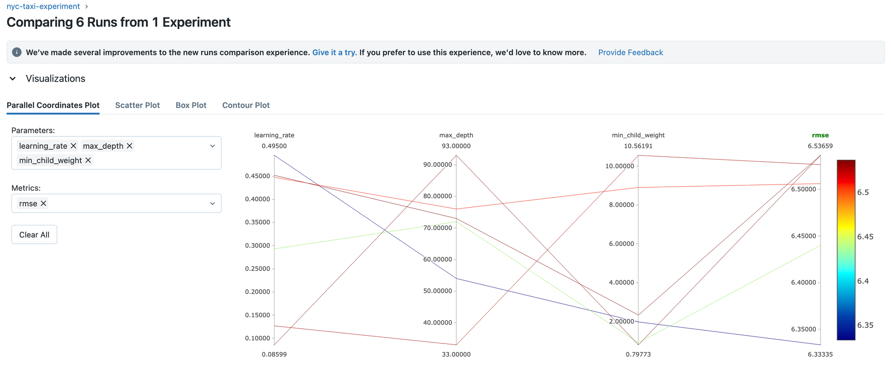
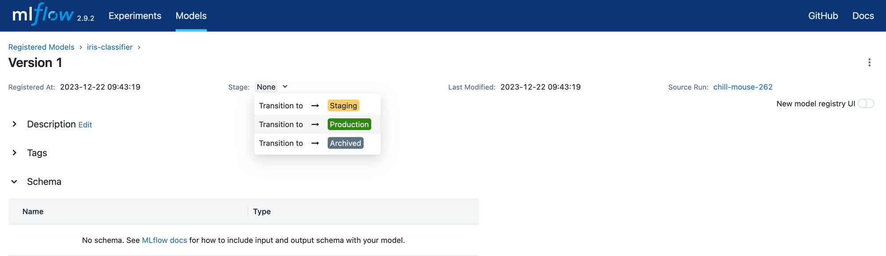

# Overview

Some notes on

- Setting up MLFlow
- Experiment tracking
- MLFlow UI
- MLFlow Python API
- Model Registry

# Terminology

**Experiment:** An experiment is the process of building an ML model containing various runs with different configurations.

**Run:** A single trail within an experiment

**Run artifact: A**ny file associated with an ML run: Examples include the model itself, package versions, etc. Each Artifact is tied to an Experiment.

**Metadata:** Metadata tied to each experiment

# Experiment Tracking

Experiment tracking helps with

- Reproducibility
- Organization
- Optimization

There are various tools like WandB, ClearML, MLFlow, and so on. We will focus on MLFlow.

# MLFlow

_An Open source platform for the machine learning lifecycle._

It's a Python package with four main modules:

- Tracking
- Models
- Model registry
- Projects

## Experiment tracking with MLFlow

MLFlow organizes experiments into runs and keeps track of any variables that may affect the model as well as its result; Such as: Parameters, Metrics, Metadata, the Model itself...

MLflow also automatically logs extra information about each run such as: Source Code, Git Commit, Start and End time and Author.

## Installation

```
pip install mlflow
conda install -c conda-forge mlflow
```

## Interacting with MLFlow

We can interact with MLFlow client via UI or python API.

### MLFlow UI

To run the UI locally

```
mlflow ui --backend-store-uri sqlite:///mlflow.db
```

The backend storage is essential to access the features of MLflow, in this command we use a SQLite backend with the file `mlflow.db` in the current running repository. This URI is also given later to the MLflow Python API `mlflow.set_tracking_uri`. By accessing the provided local url we can access the UI. Within this UI we have access to MLflow features.

Make sure to forward the port if running on remote VM (port `5000` by default).


In addition to the backend URI, we can also add an artifact root directory where we store the artifacts for runs, this is done by adding a `--default-artifact-root` parameter:

```
mlflow ui --backend-store-uri sqlite:///mlflow.db --default-artifact-root ./mlruns
```

### MLFlow Tracking Client API

In addition to the UI, an interface that is introduced in the course and used to automate processes is the Tracking API. Initialized through:

```
from mlflow.tracking import MlflowClient

MLFLOW_TRACKING_URI = "sqlite:///mlflow.db"

client = MlflowClient(tracking_uri=MLFLOW_TRACKING_URI)
```

______________________________________________________________________

The `client` is an object that allows managing experiments, runs, models and model registries (cf. Interacting with MLflow through the Tracking Client). For more information on the interface check the [docs](https://www.notion.so/mlops-zoomcamp-157d4875e035457dab7c0516867c4863?pvs=21).

### Creating new experiments

We create an experiment in the top left corner of the UI.

Using the Python API we use `client.create_experiment("nyc-taxi-experiment")`.

### Tracking an experiment with MLFlow

In order to track experiment runs, we first initialize the mlflow experiment using the code:

```python
import mlflow

mlflow.set_tracking_uri("sqlite:///mlflow.db")
mlflow.set_experiment("nyc-taxi-experiment")
```

In case the experiment does not exist, it will be automatically created.

We can then track experiment as follows:

```python
with mlflow.start_run():

    mlflow.set_tag("developer", "pytholic")

    mlflow.log_param("train-data-path", "../data/green_tripdata_2021-01.parquet")
    mlflow.log_param("val-data-path", "../data/green_tripdata_2021-02.parquet")

    alpha = 0.01
    mlflow.log_param("alpha", alpha)

    lr = Lasso(alpha)
    lr.fit(X_train, y_train)

    y_pred = lr.predict(X_val)
    rmse = mean_squared_error(y_val, y_pred, squared=False)
    mlflow.log_metric("rmse", rmse)
```

In the MLflow UI, within the `nyc-taxi-experiment` we now have a run logged with our logged parameters, tag, and metric.\*\*\*\*

### Autologging

Instead of logging manually, we can use _Autologging_ feature provided by MLFlow.

Global autologging:

```python
mlflow.autolog()
```

or framework specific:

```python
mlflow.xgboost.autolog()
```

An example

```python
import mlflow

from sklearn.model_selection import train_test_split
from sklearn.datasets import load_diabetes
from sklearn.ensemble import RandomForestRegressor

mlflow.autolog()

db = load_diabetes()
X_train, X_test, y_train, y_test = train_test_split(db.data, db.target)

rf = RandomForestRegressor(n_estimators=100, max_depth=6, max_features=3)
# MLflow triggers logging automatically upon model fitting
rf.fit(X_train, y_train)
```

The autologger then not only stores the model parameters for ease of use, it also stores other files inside the `model` (can be specified) folder inside our experiment artifact folder, these files include:

- `conda.yaml` and `requirements.txt`: Files which define the current environment for use with either `conda` or `pip` respectively
- `MLmodel` an internal MLflow file for organization
- Other framework-specific files such as the model itself

### Saving Models

```python
mlflow.<framework>.log_model(model, artifact_path="models_mlflow")
```

where we replace the `<framework>` with our model's framework (ex: `sklearn`, `xgboost`...etc). The `artifact_path` defines where in the `artifact_uri` the model is stored.

### Saving Artifacts

Storing a preprocessing module:

```python
mlflow.log_artifact("../models/preprocessor.b", artifact_path="preprocessor")
```

### Loading Models

We can load a trained model easily by `run_id`

```python
logged_model = 'runs:/f3e39da461024416b0b3a9de30b5b2c7/model'

# Load model as a PyFuncModel.
loaded_model = mlflow.pyfunc.load_model(logged_model)
```

## **Hyperparameter Optimization Tracking**

By wrapping the `hyperopt` Optimization objective inside a `with mlflow.start_run()` block, we can track every optimization run that was ran by `hyperopt`. We then log the parameters passed by `hyperopt` as well as the metric as follows:

```python
import xgboost as xgb

from hyperopt import fmin, tpe, hp, STATUS_OK, Trials
from hyperopt.pyll import scope

train = xgb.DMatrix(X_train, label=y_train)
valid = xgb.DMatrix(X_val, label=y_val)

def objective(params):
    with mlflow.start_run():
        mlflow.set_tag("model", "xgboost")
        mlflow.log_params(params)
        booster = xgb.train(
            params=params,
            dtrain=train,
            num_boost_round=1000,
            evals=[(valid, 'validation')],
            early_stopping_rounds=50
        )
        y_pred = booster.predict(valid)
        rmse = mean_squared_error(y_val, y_pred, squared=False)
        mlflow.log_metric("rmse", rmse)

    return {'loss': rmse, 'status': STATUS_OK}

search_space = {
    'max_depth': scope.int(hp.quniform('max_depth', 4, 100, 1)),
    'learning_rate': hp.loguniform('learning_rate', -3, 0),
    'reg_alpha': hp.loguniform('reg_alpha', -5, -1),
    'reg_lambda': hp.loguniform('reg_lambda', -6, -1),
    'min_child_weight': hp.loguniform('min_child_weight', -1, 3),
    'objective': 'reg:linear',
    'seed': 42
}

best_result = fmin(
    fn=objective,
    space=search_space,
    algo=tpe.suggest,
    max_evals=50,
    trials=Trials()
)
```

In this block, we defined the search space and the objective than ran the optimizer. We wrap the training and validation block inside `with mlflow.start_run()` and log the used parameters using `log_params` and validation RMSE using `log_metric`.

In the UI we can see each run of the optimizer and compare their metrics and parameters. We can also see how different parameters affect the RMSE using Parallel Coordinates Plot, Scatter Plot (1 parameter at a time) and Contour Plot.



## Model Registry

Just as MLFlow helps us store, compare and deal with ML experiment runs. It also allows us to store Models and categorize them. Model are stored and labeled depending on their status within the project.

## Assigning labels in the model registry

We can assign `labels` to our model versions in the model registry based on there status. In the old UI, this can be done by assign a `Stage` to the model such as “Staging”, “Production”, or “None”.



However, in the new UI this has been changed to `tags` and `aliases` instead.

## **Interacting with MLFlow through the Tracking Client**

In order to automate the process of registering/promoting/demoting models, we use the Tracking Client API initialized as described above:

```python
from mlflow.tracking import MlflowClient

MLFLOW_TRACKING_URI = "sqlite:///mlflow.db"

client = MlflowClient(tracking_uri=MLFLOW_TRACKING_URI)
```

### Search experiments

```python
client.search_experiments()
```

### Selecting runs

```python
from mlflow.entities import ViewType

runs = client.search_runs(
    experiment_ids="1",
    filter_string="metrics.rmse < 8.0",
    run_view_type=ViewType.ACTIVE_ONLY,
    max_results=5,
    order_by=["metrics.rmse ASC"]
)
```

Get simplified info:

```python
for run in runs:
    print(f"run id: {run.info.run_id}, rmse: {run.data.metrics['rmse']:.4f}")
```

### Interacting with model registry

Register a model

```python
import mlflow

mlflow.set_tracking_uri(MLFLOW_TRACKING_URI)

run_id = "e29ba9cc7042477a847786e3e1a97538"
model_uri = f"runs:/{run_id}/model"
mlflow.register_model(model_uri=model_uri, name="nyc-taxi-regressor")
```

List all registered models

```python
client.search_registered_models()
```

Get status of registered models

```python
model_name = "nyc-taxi-regressor"
latest_versions = client.get_latest_versions(name=model_name)

for version in latest_versions:
    print(f"version: {version.version}, stage: {version.current_stage}")
```

Promote a model to “Staging”

```python
model_version = 3
new_stage = "Staging"

# Stage a model
client.transition_model_version_stage(
    name=model_name,
    version=model_version,
    stage=new_stage,
    archive_existing_versions=False
)
```

Update the description of a model

```python
model_version = 3
new_stage = "Staging"

# Stage a model
client.transition_model_version_stage(
    name=model_name,
    version=model_version,
    stage=new_stage,
    archive_existing_versions=False
)
```

Compare models and promote to production

```python
%time test_model(name=model_name, stage="Production", X_test=X_test, y_test=y_test)
```

```python
%time test_model(name=model_name, stage="Staging", X_test=X_test, y_test=y_test)
```

```python
client.transition_model_version_stage(
    name=model_name,
    version=3,
    stage="Production",
    archive_existing_versions=True
)
```
