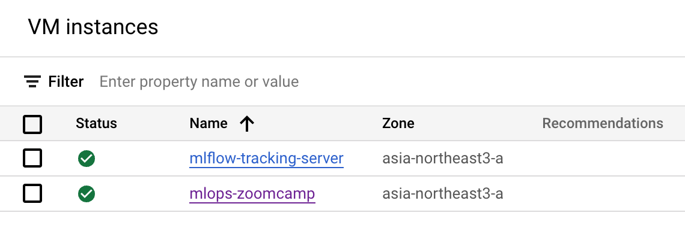
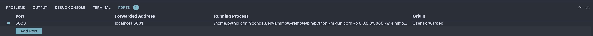

# MLFlow on GCP for Distributed Experiment Tracking

The following picture depicts the architecture of using a remote MLflow Tracking Server.


This is useful for teams with multiple data scientists to have one tracking server to be shared between all of them. So they all can do their experimentation and have everything in one place. The tracking server is not also dependent on the backend store and artifact store and can be scaled. In addition, the scientists will not lose their local data if they want to scale their machine or change it. Everything is decentralised. Some explanation found in MLFlow [documentation](https://www.mlflow.org/docs/latest/tracking/tutorials/remote-server.html).

In this distributed architecture, we will have :
- One VM as tracking server
- One storage bucket to persist artifacts like files, models, images, and so on.
- One PostgreSQL as backend store to persist MLFlow entities (runs, parameters, metrics, tags, notes, metadata, etc).

The architecture on GCP would be like the following image:


[image source](https://kargarisaac.github.io/blog/mlops/data%20engineering/2022/06/15/MLFlow-on-GCP.html)

# VM Tracking Server
First we need to create a *firewall rule* for the tracking server.
```
gcloud compute --project=<PROJECT_ID> firewall-rules create mlflow-tracking-server \
    --description="Rule for remote tracking server." \
    --direction=INGRESS \
    --priority=1000 \
    --network=default \
    --action=ALLOW \
    --rules=tcp:5000 \
    --source-ranges=0.0.0.0/0 \
    --target-tags=mlflow-tracking-server \
    --enable-logging
```

Verify in the UI.


We then can create a virtual instance as the tracking server. Don't forget to apply the firewall rules we created in the `Network Tags`.
```
gcloud compute instances create mlflow-tracking-server \
    --project=<PROJECT_ID> \
    --zone=asia-northeast3-a \
    --machine-type=e2-standard-2 \
    --network-interface=network-tier=PREMIUM,stack-type=IPV4_ONLY,subnet=default \
    --maintenance-policy=MIGRATE \
    --provisioning-model=STANDARD \
    --service-account=<PROJECT_NUMBER>-compute@developer.gserviceaccount.com \
    --scopes=https://www.googleapis.com/auth/cloud-platform \
    --tags=mlflow-tracking-server \
    --create-disk=auto-delete=yes,boot=yes,device-name=mlflow-tracking-server,image=projects/ubuntu-os-cloud/global/images/ubuntu-2004-focal-v20231213,mode=rw,size=10,type=projects/<PROJECT_ID>/zones/asia-northeast3-a/diskTypes/pd-balanced \
    --no-shielded-secure-boot \
    --shielded-vtpm \
    --shielded-integrity-monitoring \
    --reservation-affinity=any
```

Verify the instance.


We can also use GCP UI interface for all these steps.

# Database as the bankend store
We will use PostgreSQL database as the backend store.
- Go to GCP dashboard > search for SQL > select `create instance` > select `PostgreSQL`.
- Put a name and password for the instance. Select the Database version and region. You can choose one option for Zonal availability too.
- Expand the `Customize your instance`` part, and in connections, select `Private IP`` and deselect `Public IP`` and from the drop down options for `Network`` in `Private IP`` part, select `default`. This is the VPC which our virtual machine should be also on it too. So the VM and DB can see each other.
- Select `Create Instance` option.

It will take you to the overview page and will take some time to create the database instance. Then we can create a database. GCP will create a default one named postgres, but we can create a new one.

Next go to the `Databases` section and select `Create Database`. Gie it a name such as `mlflow_db`.

We also need to create a user. Go to the `User` section and click on the `Add User Account`. Select a `username`` and a `password`.

## Adding VM to hosts
Let's add the tracking server VM to out `ssh hosts` for easy login.

First of all we need to reserve a `static ip` so that it does not change every time. Go to `VPC Networks` and select `RESERVE EXTERNAL STATIC IP ADDRESS`. Select the tracking VM in setup.

Add the VM to hosts list. I will use the same SSH Key as my previous GCP instance.

```
vim ~/.ssh/config
```
```
Host gcp-mlflow-tracking-server
    HostName 34.64.84.237 # VM Public IP
    User pytholic # VM user
    IdentityFile ~/.ssh/mlops-zoomcamp # Private SSH key file
    StrictHostKeyChecking no
```

## Test connection of Tracking VM with Database
Now, you should be able to connect to the tracking server via ssh and run the following command to install and then see the list of databases.
```
sudo apt-get update
sudo apt-get install postgresql-client
gcloud sql instances list
```

Then run the following command to see if you can connect to the database.
```
psql -h CLOUD_SQL_PRIVATE_IP_ADDRESS -U USERNAME DATABASENAME
psql -h <IP_ADDRESS> -U pytholic mlflow_db
```

Now that you can connect to the database from the tracking server using private IP, let's go to the next part.

# Google Cloud Storage Bucket as Artifact Store
In the google cloud dashboard
- Search for `Cloud Storage`
- Select `Create Bucket`. 
- Do the required configs and done. 

You can also create a folder like `mlruns` in the bucket.


Note that before we can upload artifacts to this bucket, we need to create a `service account key` for authentication. Go to `Service Accounts` and then select the service account associated with out `Tracking Server`. Go to `Keys`, `Add Key`, and then generate a `JSON` key. This will download the key to your local machine. If you are using remote VM, you might have to copy this file to your tracking VM.
```
gcloud compute scp ~/Downloads/key.json <VM NAME>:~/
```

# Run the MLFlow Server on Remote Tracking Server
Now all the setup is done. `SSH` into the remote tracking VM. To avoid package conflicts, install `miniconda` and create a `venv`.

## Install miniconda.
```
mkdir -p ~/miniconda3
wget https://repo.anaconda.com/miniconda/Miniconda3-latest-Linux-x86_64.sh -O ~/miniconda3/miniconda.sh
bash ~/miniconda3/miniconda.sh -b -u -p ~/miniconda3
rm -rf ~/miniconda3/miniconda.sh

~/miniconda3/bin/conda init bash
source ~/.bashrc
```

Create `venv` and install packages.
```
pip install mlflow boto3 google-cloud-storage psycopg2-binary
```

## Port Forwarding
Connect to VM in VS Code and forward the port. 

We can also do this in `~/.ssh/config`.
```
Host gcp-mlflow-tracking-server
    HostName 34.64.84.237 # VM Public IP
    User pytholic # VM user
    IdentityFile ~/.ssh/mlops-zoomcamp # Private SSH key file
    StrictHostKeyChecking no
    LocalForward 5001 0.0.0.0:5000
```
Else, we can directly use `<VM EXTERNAL IP>:5000`.

## Run the server
Run the mlflow server:
```
mlflow server \
    -h 0.0.0.0 \
    -p 5000 \
    --backend-store-uri postgresql://<user>:<pass>@<db private ip>:5432/<db name> \
    --default-artifact-root gs://<bucket name>/<folder name>
```

Go to the address `0.0.0.0:5000` on your local machine and you should see the MLFlow UI.

# Working with remote tracking server
Let's review what we have so far.
- A remote GCP instance (`n2-standard-4`) where we run our machine learning experiments.
- Another GCP instance (`e2-standard-2`) where we launch our remote tracking server.
- A `PostrgreSQL` GCP instance to store MLFlow entities such as runs, parameters, metrics, tags, etc.
- A `GCP Cloud Storage Bucket` to persist artifacts like `models`.

Now, you can train a model on your machine or another VM and log mlflow data.

```python
import mlflow
import os

TRACKING_SERVER_HOST = "<tracking server external IP>"
mlflow.set_tracking_uri(f"http://{TRACKING_SERVER_HOST}:5000")

service_account_key_path = "../../../service_account_key.json"
os.environ["GOOGLE_APPLICATION_CREDENTIALS"] = service_account_key_path

print(f"tracking URI: '{mlflow.get_tracking_uri()}'")

from sklearn.linear_model import LogisticRegression
from sklearn.datasets import load_iris
from sklearn.metrics import accuracy_score

mlflow.set_experiment("my-experiment-1")

with mlflow.start_run():

    X, y = load_iris(return_X_y=True)

    params = {"C": 0.1, "random_state": 42}
    mlflow.log_params(params)

    lr = LogisticRegression(**params).fit(X, y)
    y_pred = lr.predict(X)
    mlflow.log_metric("accuracy", accuracy_score(y, y_pred))

    mlflow.sklearn.log_model(lr, artifact_path="models")
    print(f"default artifacts URI: '{mlflow.get_artifact_uri()}'")

mlflow.search_experiments()
```