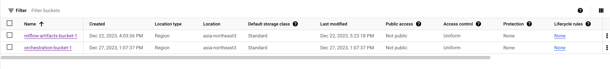
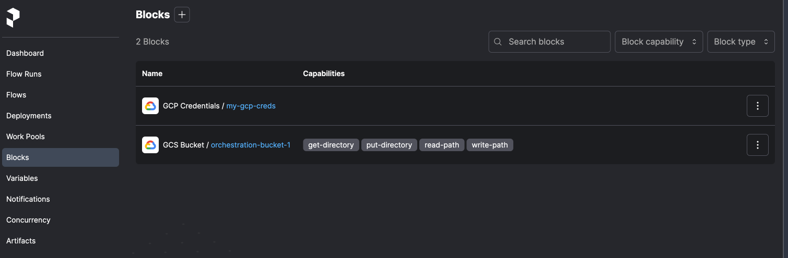

# Orchestration Overview
We can have failure points at different parts of our ML workflow, and things might break. It is important to deal with unexpected downtime and errors in an automatic fashion. 

# Simple orchestration
We will convert our notebook to python script which can be found in `03-workflow-orchestration/orchestrate_pre_prefect.py`. Run it and verify if mlflow and experiment are working.

```
python orchestrate_pre_prefect.py
```

In a separate terminal, run mlflow (make sure to forward the port in `~/.ssh/config`):
```
mlflow ui --backend-store-uri sqlite:///mlflow.db
```

# Prefect
**Prefect** orchestrates and observes out python workflows at scale. It consists of an `Orchestration API`, a `Database`, and a `UI`.
```
pip install -U prefect
```

# Terminology
**Task** - A discrete unit of work in a Prefect workflow<br>
**Flow** - Container for workflow logic<br>
**Subflow** - `Flow` called by another `flow`

## Orchestrating our workflow
Convert normal functions to Prefect `task` and `flow` as in `03-workflow-orchestration/orchestrate.py`.

Make sure to forward the prefect port (`127.0.0.1:4200`).
```
Host gcp-mlops-zoomcamp
    HostName xx.xx.xxx.xxx # VM Public IP
    User pytholic # VM user
    IdentityFile ~/.ssh/mlops-zoomcamp # Private SSH key file
    StrictHostKeyChecking no
    LocalForward 5000 0.0.0.0:5000
    LocalForward 4200 127.0.0.1:4200
```

Open prefect server in a new terminal.
```
prefect server start
```

Run the experiment.
```
python orchestrate.py
```

# Deployment
Deployments are server-side representations of flows. They store the crucial metadata needed for remote orchestration including when, where, and how a workflow should run. Deployments elevate workflows from functions that you must call manually to API-managed entities that can be triggered remotely.

## Deploying workflow from local code

### Start prefect server
Open prefect server in a new terminal.
```
prefect server start
```

### 01-Initialize Prefect Project
Initialize prefect project (select `local` if prompted).
```
prefect init
```

### 02-Create a Work Pool
Create a `Work Pool` from the UI. Select `Local Subprocess` and give it a name. Click `Next` and hit `Create`.

### 03-Deploy your flow
```
prefect deploy myflow.py:main_flow -n <NAME> -p <WORK POOL NAME> 
```

### 04-Start the Work Pool
Run in a new terminal.
```
prefect worker start -p <WORK POOL NAME> -t process
```

### 05-Start a run of the deployment
Run in another terminal.
```
prefect deployment run 'main-flow/<deployment name>'
```
It will create a `flow run` for the deployment we created earlier. Our `Worker` will pick this up and execute our workflow. You can check this in the `Worker` terminal.

## Deploy from git

### Start prefect server
Open prefect server in a new terminal.
```
prefect server start
```

### 01-Clone the repo
Create a separate repo with the `orchestrate.py` and `data`. Clone the repo with all the code.

### 02-Initialize Prefect Project
Initialize prefect project. This time select `git` instead of `local`.
```
prefect init
```

Next repeat the above steps. Make sure to push the `data` folder to git repo since prefect will clone it. We can see in the `Worker` terminal that it first clones the repo and then executes the workflow.

# Working with deployments

## Set up the key
First, we need to give storage access to our VM. Else we will get `Access denied` response.

### 1. Create a Service Account

- Go to the `Google Cloud Console`.
- Navigate to the `IAM & Admin` page.
- Click on `Service Accounts` and then `Create Service Account`.
- Follow the prompts to create a new service account, giving it the necessary storage permissions.

### 2. Download JSON Key File

- After creating the service account, click on it in the `Service Accounts` list.
- Navigate to the `Keys` tab.
- Click on `Add Key` and choose JSON. This will download a JSON key file containing the credentials.

### 3. Set the Environment Variable
- Upload the key to VM from your local machine
```
gcloud compute scp ~/Downloads/keyfile.json <VM NAME>:~/
```
- Set the `GOOGLE_APPLICATION_CREDENTIALS` environment variable in your Python script to point to the location of the downloaded JSON key file.
```python
import os

# Set the environment variable to the path of your JSON key file
os.environ["GOOGLE_APPLICATION_CREDENTIALS"] = "/path/to/your/keyfile.json"
```

## Create and store a GCP Storage Bucket with Prefect
Install `prefect-gcp` client.
```
pip install prefect-gcp
```

Follow `03-workflow-orchestration/04-working-with-deployments/create_gcs_bucket.py` to create the bucket. Note that we also modify the `Public access` and `Access control` using google storage `Python API`.

After that you can see bucket in the GCP UI.



## Using Prefect Blocks
We can also check `Prefect Blocks` section.


You can also use `prefect blocks ls` to list all the blocks. In order to use this blocks, we need to send them to the server.
```
prefect block register -m prefect_gcp
```

## Using GCP Bucket Block in Prefect

Upload data to the GCP Bucket with `03-workflow-orchestration/04-working-with-deployments/uploaded_folder_contents.py`. Reference [link](https://cloud.google.com/storage/docs/samples/storage-transfer-manager-upload-directory).

Next modify the data path as in `03-workflow-orchestration/04-working-with-deployments/orchestrate_gs.py` to download data from `GCP Bucket` and train the model.

## Using Bucket Data with Deployment

### Create a repo
I will be using a separate repository since we are using `git` and need to fetch data and code from remote `repo`.
```
orchestrate.py
prefect.yaml
orchestrate_gs.py
```

### Add deployments
Add following to `prefect.yaml`.
```
deployments:
- name: taxi_local_data
  entrypoint: orchestrate.py:main_flow
  work_pool:
    name: zoompool
- name: taxi_gcs_data
  entrypoint: orchestrate_gs.py:main_flow_gcs
  work_pool:
    name: zoompool
```

Go to the `orchestrate_gcs.py` and modify `main_flow` to `main_flow_gcs`.

### Deploy
Deploy the deployments.
```
prefect deploy --all
```

### Create an Artifact
Maybe we want to see what our `rmse` is every week or every month.

```
markdown__rmse_report = f"""# RMSE Report
3
## Summary

Duration Prediction 

## RMSE XGBoost Model

| Region    | RMSE |
|:----------|-------:|
| {date.today()} | {rmse:.2f} |
"""

create_markdown_artifact(
    key="duration-model-report", markdown=markdown__rmse_report
)
```

### Push the updated code to github
Push the changes to the repo, since we will use repo code.

### Run the deployment

Start the worker in one terminal.
```
prefect worker start -p zoompool
```

Run the deployment in a new terminal. You can also verify names in the UI under `Deployments` tab or using `prefect deployment ls`.
```
prefect deployment run 'main-flow-gcs/taxi_gcs_data'
```

You can also check `RMSE Report` under the `Artifacts` tab in Prefect UI.

### Scheduling
We can go to our deployment in Ui and click on `Schedule`. This will schedule automatic runs for our experiment. You can check all the schedules runs by going to `Flows` and then `<FLOW NAME>`.

We can also use `CLI` for this.
```
prefect deployment set-schedule main-flow/tax1 --interval 120
```

# Prefect Cloud
Hosted by Prefect in the cloud. We can switch from locally hosted server to cloud-based. We will use separate repo again with:
```
prefect.yaml
orchestrate_gs.py
```

## Create an account
Head over to `app.prefect.cloud` and create an account.

## Login
In the terminal type `prefect cloud login`. You can choose `Web Browser` or an `API Key`. 

To create an API key:
- Click on the Account Icon at the bottom left corner
- Select a name and create the key.
- Copy the API key. When prompted, paste it in the terminal.

Verify by running `prefect version`.

## Running deployments on cloud

Start worker.
```
prefect worker start -p zoompool -t process
```

Register blocks.
```
prefect block register -m prefect_gcp
```

Create a new bucket (modify the name) and upload data in it. Modify the bucket name in `orchestrate_gs.py`
```
python create_gcs_bucket.py
```

Deploy.
```
prefect deploy --all
```

Go to the `Prefect UI > Deployments`. Click on `taxi_gcs_data` and hit `Run > Quick Run`.